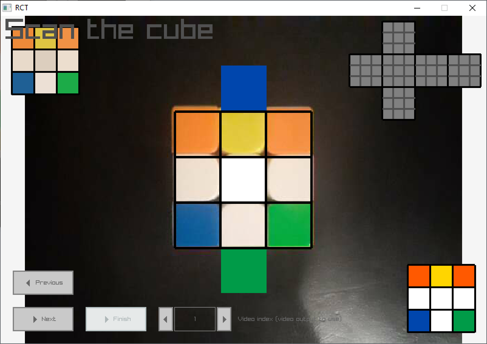

# RCT

A Rubik's Cube Tutorial application for beginners learning to solve the cube.

# Project

* I created a Rubik's Cube Tutorial (RCT) application as an educational project for beginners learning to solve the cube and those seeking to improve their solving skills with a beginner CFOP method
* External dependencies are OpenCV for video I/O and Raylib for graphics rendering
* Program has Linux and Windows ports, which can be downloaded at the release page
* Source code is licensed under the GPLv3 license

***Disclaimer**: The project is still under development and should be used alongside a more full-fledged tutorial. Additionally, the last steps (OLL and PLL) are based off of a slightly different beginner's method [*(as shown here)*](https://sarah.cubing.net/3x3x3/beginners-method#section/step7) that isn't the widely-used method used [*here*](https://ruwix.com/the-rubiks-cube/how-to-solve-the-rubiks-cube-beginners-method/), [*here*](https://rubikscu.be/#tutorial), and [*here*](https://cubesolve.com/).*
# Functionality

* You are able to "scan" your cube and store its state within the program
* Program can then provide a step-by-step explanation to solving your cube (assuming scanning is completely valid)
* However, the user interface is minimal and not ideal for beginners currently
* Program is still being actively worked on to hopefully realise such a program

# Controls

_Alternatively, buttons can be used in the GUI instead._

* **Left Control**: Toggle camera
* **Space**: Store current face and move on to next / Fast forward cube animation
* **Backspace**: Remove current face and move to previous
* **N**: Reset all scanned faces
* **Right arrow**: Move on to next step
* **Period**: Skip cube animation

## Debug-only Controls

* **Q**: Load pre-made scramble (for testing)

|Move|Key|
|----|---|
|U   |U  |
|U'  |Y  |
|U2  |I  |
|L   |L  |
|L'  |K  |
|L2  |;  |
|F   |F  |
|F'  |C  |
|F2  |G  |
|R   |R  |
|R'  |E  |
|R2  |T  |
|B   |B  |
|B'  |V  |
|B2  |N  |
|D   |D  |
|D'  |S  |
|D2  |X  |

# Requirements

* Windows or Linux-based OS
* Raylib and Raygui (currently v4.5.0 and v3.6 respectively) (already pre-packaged)
* OpenCV v4.7.0 **if on Linux** or v4.5.5 on Windows (already pre-packaged)

# Screenshots

# Thanks

Thanks to:
* [@AndroidSteve](https://www.github.com/AndroidSteve)
* [@chan94306](https://www.github.com/chan94306)
* [@16magrzywacz](https://www.github.com/16magrzywacz)
* and others for advice and help in creating this project!
